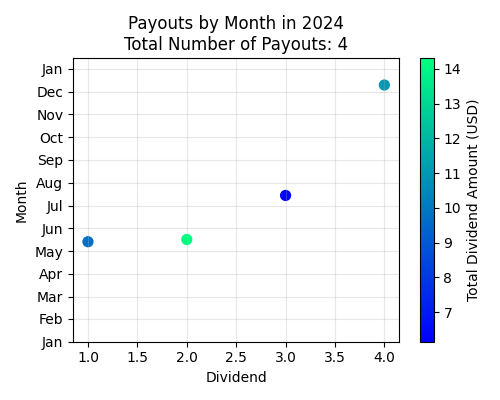
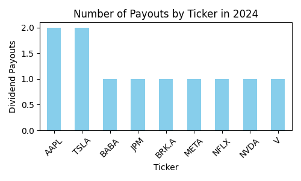

#### Revolut Dividends 2024
This Jupyter notebook is intended to help analyze data from an imported revolut statement in xlsx format regarding dividends collected in 2024.
 This is my practice project to learn to work with and analyze data with python and to produce visualizations.

##### What this Jupyter notebook does:
- clean up data from the imported file so it can be analyzed,
- provide info on dividends collected in USD in 2024,
- provide info on dividends collected in EUR in 2024,
- provide a summary for year 2024,
- present visualizations to help showcase the insights obtained.

##### Notes:
- this notebook is designed to process data from your Revolut statement. This statement can be generated from your Revolut Invest section (in app: Invest > More > Documents > Brokerage account > Account statement > select Excel).
- this notebook provides insights for dividends collected in EUR or USD
- [colors for matplotlib](https://matplotlib.org/3.3.0/gallery/color/named_colors.html)
- [colormaps for matplotlib](https://matplotlib.org/stable/users/explain/colors/colormaps.html)

##### Example output:

##### Space for improvement:
- add a column with 'year' to store the year extracted from 'date'
- additional visualizations
- comparison with other years
- could optimize for currencies other than EUR and USD
- could fetch live exchange rates for conversions between EUR and USD
