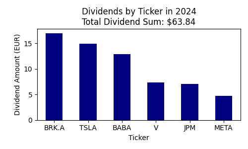
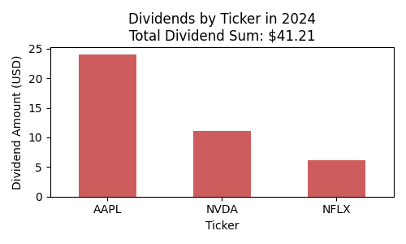

#### Revolut Dividends 2024
This Jupyter notebook is intended to help analyze data from an imported revolut statement in csv format regarding dividends collected in 2024.
 This is my practice project to learn to work with and analyze data with python and to produce visualizations.

##### What this Jupyter notebook does:
- clean up the data in the imported csv file so they can be analyzed
- display data on dividends collected in USD in 2024
- display data on dividends collected in EUR in 2024
- provide a summary and key insights for year 2024
- show a visualization of dividends collected per ticker regardless of currency

##### Notes:
- this notebook is designed to process data from your Revolut statement. This statement can be generated from your Revolut Invest section (in app: Invest > More > Documents > Brokerage account > Account statement > select Excel). Once you have the xlsx, you just need to save it as a csv.
- this notebook provides insights for dividends collected in EUR or USD
- [colors for matplotlib](https://matplotlib.org/3.3.0/gallery/color/named_colors.html)
- [colormaps for matplotlib](https://matplotlib.org/stable/users/explain/colors/colormaps.html)

##### Example output:

 **Here are the key insights:**
 In 2024, dividends were paid by a total of 9 unique instruments: AAPL, BABA, BRK.A, JPM, META, NFLX, NVDA, TSLA, V.
 The highest dividend paying instrument in your portfolio in 2024 was AAPL.
 Dividends for year 2024 totalled 433.84 EUR and 201.21 USD.
 This sums up to a grand total of 620.97 EUR (USD converted to EUR using the provided rate) or 669.76 USD (EUR converted to USD using the provided rate).
 FX Rate used: 1 EUR = 1.08 USD, 1 USD = 0.93 EUR (Updated on 2025/03/26).

##### Space for improvement:
- add a column with 'year' to store the year extracted from 'date'
- additional visualizations
- comparison with other years
- could optimize for currencies other than EUR and USD
- could fetch live exchange rates for conversions between EUR and USD
